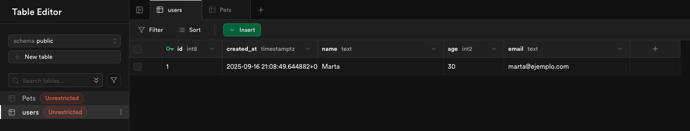
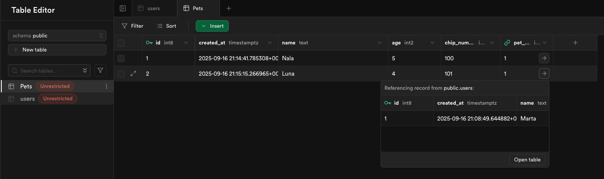
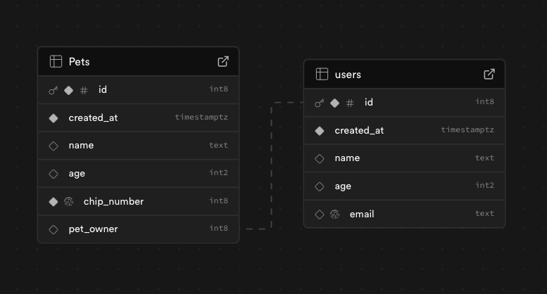

## SUPABASE

1. Créate una cuenta en Supabase

2. Crea dos tablas distintas: 

    2.1 - Usuarios (nombre, edad, e-mail)

    2.2 - Mascota (nombre, edad, chip_num, usuario[FOREIGN-KEY])

3. Saca una captura de pantalla de la configuración

4. Crea un repositorio con un readme con las capturas de pantalla

5. Entrega la URL del repositorio

### CAPTURAS DE PANTALLA

#### Tabla Users

#### Tabla Pets

#### Diagrama UML
